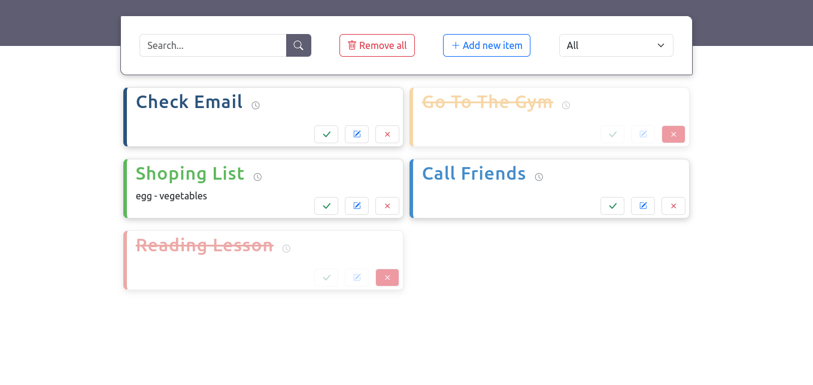
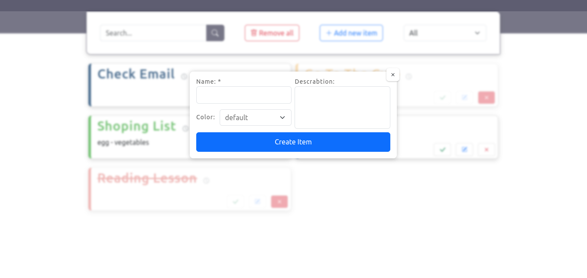
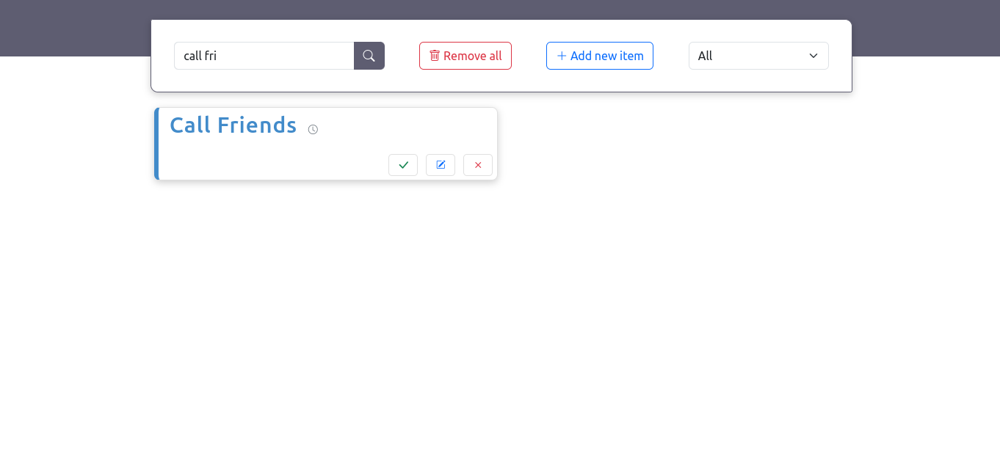
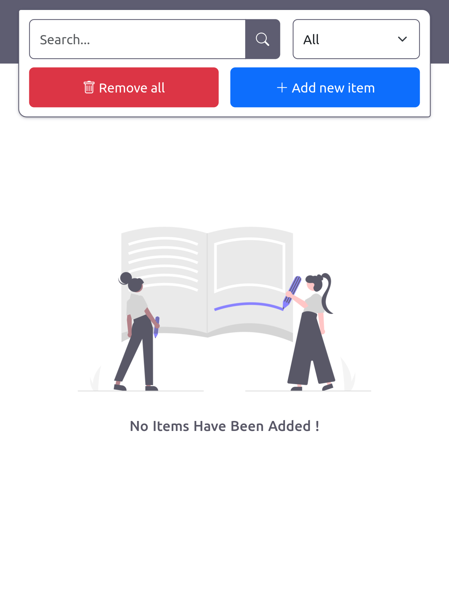

# Todo List React App

### Try it : [link](link)

 

## prview

#### You can complete, edit, delete, add description and  view creation date :

---
#### create new todo :

---
#### filtering todos :

---
#### app is responsive :

 

### [see more projects](https://github.com/amirhosein06?tab=repositories)